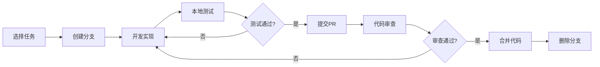

# AI-CMD 优化实施计划

## 1. 概览

本文档定义了 AI-CMD 项目优化的执行策略、分支管理、团队协作和质量保证流程。

### 1.1 目标

- 系统性提升项目质量
- 保证主分支稳定性
- 建立可持续的开发流程
- 最小化风险和中断

### 1.2 时间线

```
当前 ────▶ 2-3个月后
   │
   ├─ Phase 1: 基础质量提升（4-6周）
   ├─ Phase 2: 性能和体验优化（3-4周）
   └─ Phase 3: 扩展性建设（4-6周）
```

## 2. 分支策略

### 2.1 分支结构

```
main (稳定分支，生产就绪)
  │
  └─ optimized (优化主分支，集成所有优化)
       │
       ├─ opt/test-infrastructure (测试基础设施)
       ├─ opt/code-quality (代码质量改进)
       ├─ opt/security (安全性增强)
       ├─ opt/performance (性能优化)
       ├─ opt/ux-improvements (用户体验)
       └─ opt/extensibility (扩展性)
```

### 2.2 分支命名规范

**前缀规范**:
- `opt/` - 优化相关的功能分支
- `test/` - 测试相关
- `doc/` - 文档更新
- `fix/` - Bug修复

**命名示例**:
- `opt/test-infrastructure` - 测试基础设施建设
- `opt/add-type-hints` - 添加类型注解
- `opt/cache-optimization` - 缓存优化
- `doc/api-reference` - API文档

### 2.3 分支生命周期

1. **创建**: 从 `optimized` 分支创建功能分支
2. **开发**: 在功能分支上进行开发和测试
3. **审查**: 创建PR到 `optimized` 分支
4. **合并**: 审查通过后合并到 `optimized`
5. **清理**: 合并后删除功能分支
6. **发布**: 阶段性将 `optimized` 合并到 `main`

### 2.4 合并策略

**optimized 分支合并策略**:
- 使用 Squash Merge 保持历史清晰
- 要求PR审查通过
- 要求CI检查全部通过
- 要求至少一个批准

**main 分支合并策略**:
- 使用 Merge Commit 保留完整历史
- 仅在阶段完成时合并
- 需要完整的回归测试
- 需要项目负责人批准

## 3. 工作流程

### 3.1 任务认领流程



### 3.2 开发步骤

**1. 准备工作**
```bash
# 从 optimized 分支创建新分支
git checkout optimized
git pull origin optimized
git checkout -b opt/your-feature-name
```

**2. 开发实现**
```bash
# 进行代码修改
# 频繁commit，保持commit粒度合理
git add .
git commit -m "描述性提交信息"
```

**3. 本地验证**
```bash
# 运行代码格式化
uv run black src/

# 运行代码检查
uv run flake8 src/

# 运行类型检查（如已配置）
uv run mypy src/

# 运行测试
uv run pytest

# 运行覆盖率检查
uv run pytest --cov=aicmd --cov-report=html
```

**4. 提交PR**
```bash
# 推送分支
git push origin opt/your-feature-name

# 在GitHub上创建PR到 optimized 分支
# PR标题格式: [优化] 简短描述
# PR描述使用模板（见下文）
```

**5. 代码审查和修改**
- 响应审查意见
- 推送新的commit
- CI自动运行测试

**6. 合并和清理**
- 审查通过后由维护者合并
- 本地删除已合并分支
```bash
git checkout optimized
git pull origin optimized
git branch -d opt/your-feature-name
```

### 3.3 PR模板

```markdown
## 任务信息
- 任务编号: TASK-X-XXX
- 任务名称: XXX
- 相关文档: OPTIMIZATION_TASKS.md

## 变更概述
<!-- 简要描述本PR的主要变更 -->

## 变更类型
- [ ] 新增功能
- [ ] Bug修复
- [ ] 性能优化
- [ ] 代码重构
- [ ] 测试添加
- [ ] 文档更新
- [ ] 配置变更

## 详细变更
<!-- 列出主要的代码变更 -->

## 测试说明
- [ ] 添加了新的测试
- [ ] 所有测试通过
- [ ] 手动测试通过
- [ ] 测试覆盖率: XX%

## 影响范围
<!-- 描述可能受影响的功能或模块 -->

## 截图/演示
<!-- 如有UI变化，添加截图或GIF -->

## 检查清单
- [ ] 代码遵循项目规范
- [ ] 添加了必要的文档
- [ ] 更新了相关配置
- [ ] CI检查全部通过
- [ ] 无安全风险
- [ ] 向后兼容

## 额外说明
<!-- 其他需要说明的内容 -->
```

## 4. 质量保证

### 4.1 代码审查标准

**必须检查**:
1. ✅ 代码功能正确性
2. ✅ 测试覆盖充分性
3. ✅ 代码风格一致性
4. ✅ 文档完整性
5. ✅ 性能影响
6. ✅ 安全考虑
7. ✅ 向后兼容性

**审查检查点**:
- 代码逻辑清晰，无明显bug
- 变量命名有意义
- 函数职责单一
- 错误处理完善
- 日志记录适当
- 配置灵活可控
- 测试用例充分

### 4.2 CI/CD流程

**自动化检查**（每次PR和Push）:
```yaml
1. 代码格式检查 (black --check)
2. 代码风格检查 (flake8)
3. 类型检查 (mypy) [如已配置]
4. 单元测试 (pytest)
5. 集成测试 (pytest integration/)
6. 测试覆盖率报告 (pytest-cov)
7. 安全扫描 (bandit) [可选]
8. 依赖检查 (pip-audit) [可选]
```

**阶段性检查**（合并到main前）:
```yaml
1. 完整回归测试
2. 性能基准测试
3. 兼容性测试（多Python版本）
4. 文档构建测试
5. 示例代码验证
```

### 4.3 测试策略

**测试金字塔**:
```
        /\
       /  \     E2E测试 (10%)
      /────\
     /      \   集成测试 (20%)
    /────────\
   /          \ 单元测试 (70%)
  /────────────\
```

**覆盖率目标**:
- 核心模块: > 85%
- 工具模块: > 75%
- 整体项目: > 80%

**测试类型**:
1. **单元测试**: 测试单个函数/方法
2. **集成测试**: 测试模块间交互
3. **端到端测试**: 测试完整工作流
4. **性能测试**: 测试响应时间和资源使用
5. **安全测试**: 测试安全漏洞

## 5. 里程碑和发布

### 5.1 里程碑定义

**Milestone 1: 测试和质量基础** (Week 1-6)
- 目标: 建立测试基础设施，代码质量达标
- 可交付:
  * 完整的测试套件
  * CI/CD流程
  * 代码覆盖率 > 80%
  * 类型检查通过
- 验收: 所有Phase 1任务完成

**Milestone 2: 性能和体验优化** (Week 7-10)
- 目标: 显著提升性能和用户体验
- 可交付:
  * 性能优化报告
  * 新用户界面
  * 命令历史功能
  * 智能建议系统
- 验收: 所有Phase 2任务完成

**Milestone 3: 扩展性和生态** (Week 11-16)
- 目标: 建立可扩展架构和生态系统
- 可交付:
  * 插件系统
  * Web UI（可选）
  * IDE集成
  * API服务
- 验收: 所有Phase 3任务完成

### 5.2 发布计划

**Alpha版本** (Milestone 1 完成)
- 版本号: v0.5.0-alpha
- 目标: 内部测试和验证
- 发布到: GitHub Releases (Pre-release)
- 重点: 稳定性和测试覆盖

**Beta版本** (Milestone 2 完成)
- 版本号: v0.5.0-beta
- 目标: 公开测试
- 发布到: GitHub Releases, PyPI (Beta)
- 重点: 性能和用户反馈

**正式版本** (Milestone 3 完成)
- 版本号: v0.5.0 或 v1.0.0
- 目标: 生产就绪
- 发布到: GitHub Releases, PyPI, 文档网站
- 重点: 完整功能和文档

### 5.3 发布检查清单

**发布前必须完成**:
- [ ] 所有计划功能已实现
- [ ] 所有测试通过（单元、集成、E2E）
- [ ] 测试覆盖率达标
- [ ] 性能基准测试通过
- [ ] 安全审计通过
- [ ] 文档完整且更新
- [ ] CHANGELOG.md 更新
- [ ] 版本号更新（所有文件）
- [ ] 示例代码验证
- [ ] 向后兼容性验证
- [ ] 已知问题文档化

**发布流程**:
1. 创建发布分支 `release/v0.5.0`
2. 更新版本号和文档
3. 完整测试验证
4. 合并到main分支
5. 打tag: `v0.5.0`
6. 推送到GitHub
7. 构建和发布到PyPI
8. 更新文档网站
9. 发布公告

## 6. 团队协作

### 6.1 角色和职责

**项目负责人**:
- 审核和批准重要决策
- 代码审查和质量把控
- 发布管理
- 路线图规划

**核心开发者**:
- 任务实现和提交
- 代码审查（互相审查）
- Bug修复
- 文档编写

**贡献者**:
- 功能实现
- Bug报告和修复
- 文档改进
- 测试补充

### 6.2 沟通渠道

**GitHub Issues**:
- 功能请求
- Bug报告
- 讨论和提问

**Pull Requests**:
- 代码审查
- 实现讨论
- 技术决策

**Discussions**:
- 架构讨论
- 最佳实践
- 使用交流

### 6.3 会议节奏

**每周同步**（可选）:
- 进度更新
- 问题讨论
- 任务分配

**里程碑回顾**:
- 成果展示
- 经验总结
- 计划调整

## 7. 风险管理

### 7.1 风险识别

| 风险 | 可能性 | 影响 | 缓解措施 |
|------|--------|------|----------|
| 测试编写时间超预期 | 高 | 中 | 调整覆盖率目标，聚焦核心模块 |
| 性能优化效果不明显 | 中 | 中 | 建立基准测试，数据驱动优化 |
| 向后兼容性破坏 | 中 | 高 | 严格审查，提供迁移工具 |
| 插件系统设计不当 | 中 | 高 | 充分设计评审，参考成熟方案 |
| 资源不足导致延期 | 中 | 中 | 调整优先级，分阶段实施 |

### 7.2 应对策略

**测试超时**:
- 降低覆盖率目标到60-70%
- 先覆盖核心模块
- 逐步补充测试

**性能问题**:
- 建立性能监控
- 基准测试对比
- 优先优化热点

**兼容性问题**:
- 保持API稳定
- 添加弃用警告
- 提供迁移指南
- 支持旧配置格式

**资源限制**:
- 优先实施P0/P1任务
- Phase 3可选实施
- 社区贡献补充

## 8. 成功标准

### 8.1 技术指标

**代码质量**:
- [x] 测试覆盖率 > 80%
- [x] 所有函数有类型注解
- [x] Flake8零警告
- [x] Mypy检查通过
- [x] 安全扫描无高危

**性能指标**:
- [x] 缓存命中 < 100ms
- [x] API调用 < 3s（P95）
- [x] 启动时间 < 500ms
- [x] 内存占用 < 50MB

### 8.2 项目指标

**开发效率**:
- [x] PR平均审查时间 < 2天
- [x] Bug修复时间 < 1周
- [x] 文档完整度 > 90%

**用户满意度**:
- [x] GitHub Stars增长
- [x] Issue响应及时
- [x] 用户反馈积极

## 9. 文档和知识管理

### 9.1 必需文档

**代码文档**:
- API参考文档（自动生成）
- 模块设计文档
- 接口规范

**用户文档**:
- 使用教程
- 配置指南
- FAQ
- 故障排查

**开发文档**:
- 架构设计文档
- 贡献指南
- 测试指南
- 发布流程

### 9.2 知识分享

- 技术决策记录（ADR）
- 最佳实践总结
- 常见问题文档
- 代码示例库

## 10. 总结

本实施计划提供了完整的优化执行框架，包括：
- ✅ 清晰的分支策略
- ✅ 规范的工作流程
- ✅ 严格的质量保证
- ✅ 明确的里程碑
- ✅ 有效的风险管理

通过遵循本计划，我们可以：
1. 系统性提升项目质量
2. 保持开发的可持续性
3. 最小化风险和中断
4. 建立良好的协作文化

---

*本实施计划与 OPTIMIZATION_PLAN.md 和 OPTIMIZATION_TASKS.md 配套使用*  
*根据实际执行情况可灵活调整*
